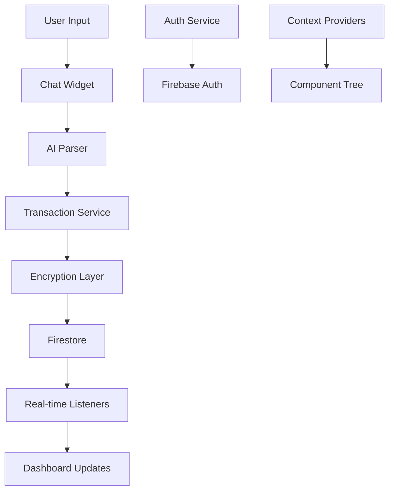

# 💰 Wallet Tracker# 💰 Wallet Tracker


A simple, secure personal finance tracker with client-side encryption**A simple, secure personal finance tracker with client-side encryption**


> 🔒 All your financial data is encrypted on your device before being stored> 🔒 All your financial data is encrypted on your device before being stored


## 🚀 Quick Start## � Quick Start


```bash```bash

git clone https://github.com/HadiuzzamanBappy/Wallet-Tracker.git# Install and run

cd Wallet-Trackergit clone https://github.com/HadiuzzamanBappy/Wallet-Tracker.git

npm installcd Wallet-Tracker

npm run devnpm install

```npm run dev

```

Create `.env.local` with your Firebase config:

Create `.env.local` with your Firebase config:

```env```env

VITE_FIREBASE_API_KEY=your_keyVITE_FIREBASE_API_KEY=your_key

VITE_FIREBASE_AUTH_DOMAIN=your_project.firebaseapp.com  VITE_FIREBASE_AUTH_DOMAIN=your_project.firebaseapp.com  

VITE_FIREBASE_PROJECT_ID=your_project_idVITE_FIREBASE_PROJECT_ID=your_project_id

VITE_FIREBASE_STORAGE_BUCKET=your_project.appspot.comVITE_FIREBASE_STORAGE_BUCKET=your_project.appspot.com

VITE_FIREBASE_MESSAGING_SENDER_ID=123456789VITE_FIREBASE_MESSAGING_SENDER_ID=123456789

VITE_FIREBASE_APP_ID=your_app_idVITE_FIREBASE_APP_ID=your_app_id

VITE_OPENROUTER_API_KEY=your_openrouter_keyVITE_OPENROUTER_API_KEY=your_openrouter_key (optional)

``````


## ✨ What It Does## ✨ What It Does


- **Track Money**: Income, expenses, loans, credits- **Track Money**: Income, expenses, loans, credits

- **AI Chat**: "Spent $50 on groceries" → automatically categorized  - **AI Chat**: "Spent $50 on groceries" → automatically categorized  

- **Budgets**: Set limits, see progress bars- **Budgets**: Set limits, see progress bars

- **Analytics**: Monthly spending insights- **Analytics**: Monthly spending insights

- **Privacy**: Everything encrypted on your device- **Privacy**: Everything encrypted on your device

- **Sync**: Works across all your devices- **Sync**: Works across all your devices


## 🛠️ Tech Stack## �️ Tech Stack


- **Frontend**: React + Vite + Tailwind CSS- **Frontend**: React + Vite + Tailwind CSS

- **Backend**: Firebase (Auth + Firestore)- **Backend**: Firebase (Auth + Firestore)

- **Security**: Client-side AES-256 encryption- **Security**: Client-side AES-256 encryption

- **AI**: OpenRouter API for transaction parsing- **AI**: OpenRouter API for transaction parsing


## 📁 Project Structure## 📁 Project Structure


``````

src/src/

├── components/     # UI components├── components/     # UI components

├── services/       # Business logic (auth, transactions, budget)├── services/       # Business logic (auth, transactions, budget)

├── hooks/          # Custom React hooks  ├── hooks/          # Custom React hooks  

├── context/        # State management├── context/        # State management

├── utils/          # Encryption, AI parsing, helpers├── utils/          # Encryption, AI parsing, helpers

└── config/         # Firebase setup└── config/         # Firebase setup

``````


## 🔧 Development## 🔧 Development

npm run dev

```bash```

npm run dev         # Start dev server

npm run build       # Build for production  ### Firebase Setup

npm run lint        # Check code quality

npm run deploy      # Deploy to Firebase1. Go to [Firebase Console](https://console.firebase.google.com/) → Create Project

```2. **Authentication**: Enable Email/Password + Google Sign-in

3. **Firestore**: Create database in production mode

## 📖 Documentation4. **Settings**: Copy config to `.env` file


- **[CONTRIBUTING.md](doc/CONTRIBUTING.md)** - How to contribute```env

- **[DEPLOYMENT.md](doc/DEPLOYMENT.md)** - Deploy to production  VITE_FIREBASE_API_KEY=your_firebase_api_key

- **[API_REFERENCE.md](doc/API_REFERENCE.md)** - Developer APIsVITE_FIREBASE_AUTH_DOMAIN=your-project.firebaseapp.com

VITE_FIREBASE_PROJECT_ID=your-project-id

## 🚀 DeployVITE_FIREBASE_STORAGE_BUCKET=your-project.appspot.com

VITE_FIREBASE_MESSAGING_SENDER_ID=123456789

**Firebase Hosting:**VITE_FIREBASE_APP_ID=1:123456789:web:abc123def456

```

```bash

npm run build> 📖 **Need help?** See [DEPLOYMENT.md](doc/DEPLOYMENT.md) for detailed production setup.

npm run deploy  

```## 🎯 How It Works


**Other platforms:** Upload the `dist/` folder to any static host (Vercel, Netlify, etc.)### AI-Powered Transaction Entry


## 🤝 ContributingSimply chat with your wallet! Type natural language descriptions:


1. Fork the repo**Examples:**

2. Create a feature branch  - *"I bought groceries for 500 taka today"* → 🍔 Food expense, 500 BDT

3. Make your changes- *"Received salary 50000"* → � Income, 50,000 BDT  

4. Submit a pull request- *"Lent 2000 to my friend"* → 📤 Credit given, 2,000 BDT

- *"Borrowed 5000 from brother"* → 📥 Loan taken, 5,000 BDT

See [CONTRIBUTING.md](doc/CONTRIBUTING.md) for details.

### Key Capabilities

## 📄 License

| Feature | Description |

MIT License - see [LICENSE](LICENSE) file.|---------|-------------|

| **🤖 Smart Parsing** | Understands English & Bengali, amounts, dates, and context |

---| **⚡ Real-time Updates** | Balance recalculates instantly with every change |

| **🔐 Secure by Design** | Client-side encryption, no plaintext in database |

**Questions?** [Open an issue](https://github.com/HadiuzzamanBappy/Wallet-Tracker/issues)| **📊 Rich Analytics** | Spending patterns, budget tracking, export capabilities |
| **🎨 Modern UI** | Responsive design with dark/light theme support |

### Transaction Categories

Auto-categorized with visual indicators:
- 🍔 **Food** (groceries, restaurants) • 🚗 **Transport** (uber, fuel)
- 🎬 **Entertainment** (movies, games) • 🛍️ **Shopping** (clothes, online)  
- 📄 **Bills** (utilities, rent) • 🏥 **Health** (medical, pharmacy)
- 📚 **Education** (courses, books) • 💼 **Income** (salary, freelance)

> � **Want to learn more?** Check out [USER_GUIDE.md](doc/USER_GUIDE.md) for detailed usage instructions.

## 🛠️ Technology Stack

| Layer | Technology | Purpose |
|-------|------------|---------|
| **Frontend** | React 18 + Vite | Modern UI framework with fast dev server |
| **Styling** | Tailwind CSS | Utility-first CSS with custom gradients |
| **Icons** | Lucide React | Consistent, modern iconography |
| **Backend** | Firebase | Authentication + Firestore NoSQL database |
| **State** | React Context + Hooks | Centralized state management |
| **Security** | Client-side Encryption | AES encryption before database storage |
| **AI Parsing** | OpenRouter API | Natural language transaction processing |
| **Build** | Vite | Fast bundling and hot module replacement |

## 🏗️ Architecture Overview



### Key Directories

```text
src/
├── 📁 components/     # React UI components
│   ├── Dashboard/     # Main app interface
│   ├── Transaction/   # CRUD operations
│   ├── User/          # Profile & settings
│   └── UI/            # Reusable components
├── 📁 services/       # Business logic
│   ├── authService.js        # User authentication
│   ├── transactionService.js # Data operations
│   └── budgetService.js      # Budget calculations
├── 📁 context/        # State management
├── 📁 hooks/          # Custom React hooks
└── 📁 utils/          # Utilities & encryption
```

> 🏛️ **Architecture deep-dive**: See [ARCHITECTURE.md](doc/ARCHITECTURE.md) for detailed technical documentation.

## 🔐 Security & Privacy

### Data Protection
- **🔒 Client-side Encryption**: All sensitive data encrypted before storage
- **🛡️ Firebase Security Rules**: User-scoped data access only  
- **🔐 Re-authentication**: Required for sensitive operations
- **📤 Data Portability**: Export your data anytime

### Security Rules Preview
```javascript
// Users can only access their own data
match /users/{userId} {
  allow read, write: if request.auth.uid == userId;
  
  match /transactions/{transactionId} {
    allow read, write: if request.auth.uid == userId;
  }
}
```

> 🔐 **Complete security guide**: See [SECURITY.md](doc/SECURITY.md) for full details.

## 🛠️ Development

### Available Scripts

```bash
npm run dev        # Start development server
npm run build      # Build for production  
npm run lint       # Run ESLint
npm run preview    # Preview production build
npm run deploy     # Deploy to Firebase Hosting
```

### Quick Development Setup

```bash
# Install dependencies
npm install

# Start with hot reload
npm run dev

# Run linting
npm run lint

# Test build
npm run build && npm run preview
```

> 👥 **Want to contribute?** Check out [CONTRIBUTING.md](doc/CONTRIBUTING.md) for guidelines.

## 🐛 Troubleshooting

| Issue | Solution | Reference |
|-------|----------|-----------|
| **Firebase Auth Errors** | Check `.env` config and Firebase console | [USER_GUIDE.md](doc/USER_GUIDE.md#troubleshooting) |
| **Balance Not Updating** | Verify console logs, check event listeners | [ARCHITECTURE.md](doc/ARCHITECTURE.md#event-system) |
| **Parsing Failures** | Test with `scripts/test_simple_ai_parser.mjs` | [API_REFERENCE.md](doc/API_REFERENCE.md#ai-parser) |
| **Build Issues** | Run `npm run lint` and check dependencies | [CONTRIBUTING.md](doc/CONTRIBUTING.md#development) |

> � **Need more help?** Check our comprehensive [troubleshooting guide](doc/USER_GUIDE.md#troubleshooting-and-common-issues).

## 📊 Project Status

### ✅ Production Ready
- ✅ User authentication & profile management
- ✅ Real-time transaction management  
- ✅ AI-powered chat interface
- ✅ Client-side encryption & security
- ✅ Responsive UI design
- ✅ Data export capabilities

### 🚧 Roadmap
- [ ] Advanced analytics dashboard
- [ ] Budget planning & alerts
- [ ] Multi-currency support  
- [ ] Receipt photo uploads
- [ ] Mobile app (React Native)
- [ ] Advanced reporting & charts

## 🤝 Community & Support

### Links
- 📂 **Repository**: [GitHub](https://github.com/HadiuzzamanBappy/Wallet-Tracker)
- 🐛 **Bug Reports**: [Issues](https://github.com/HadiuzzamanBappy/Wallet-Tracker/issues)
- 💡 **Feature Requests**: [Discussions](https://github.com/HadiuzzamanBappy/Wallet-Tracker/discussions)

### Contributing
1. Fork the repository
2. Read [CONTRIBUTING.md](doc/CONTRIBUTING.md)  
3. Create a feature branch
4. Follow the development guidelines
5. Submit a pull request

### License
**MIT License** - Free to use for personal and commercial projects.

---

**Made with ❤️ using React, Firebase, and AI-powered transaction parsing**

*Ready to take control of your finances? [Get started now](#-quick-start)!*
